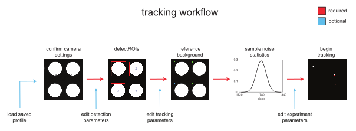

# Introduction

## Installation

### Prerequisites

**MATLAB**

For best results, use MARGO with **MATLAB 2016b** or newer. MARGO but has generally been designed to be backwards compatible with older versions of MATLAB. In addition to the base installation of MATLAB, MARGO uses the image acquisition and image processing toolboxes.

**Psychtoolbox (optional)**

MARGO requires on [Psychtoolbox 3](http://psychtoolbox.org/) for support of external displays.

**MARGO installation**

The MARGO repository can be cloned via the github UI by downloading and extracting a zip file (**Clone or Download** > **Download ZIP**) or via the git command line API with the following command:
```
git clone https://github.com/de-Bivort-Lab/margo.git
```

After cloning the repository, add the MARGO directory to MATLAB's path by navigating to the margo directory and running:

```
add(genpath(margo));
```

Alternatively, permanently add MARGO and all sub folders to the MATLAB path by adding by running:

```
pathtool
```

## Quickstart Guide

We recommend that new users read about MARGO's [experimental workflow](##experimental-workflow) and follow the sample video tutorial included in this documentation for more complete instructions on getting started in MARGO.

<figure style="text-align: center">
    
    <figcaption class="center_cap" style="text-align: center">
    </figcaption>
</figure>

## Overview
--------

MARGO is a MATLAB-based software package for real-time, high-throughput
tracking of animals. Rapid tracking and identity sorting in real-time
means that MARGO is particularly useful for applications requiring
closed-loop control of individual stimulus delivery and massively
high-throughput behavioral screens where video storage and processing
would otherwise be rate-limiting. MARGO offers additional utility through GUI-based customization of tracking parameters, hardware settings, ROI-detection, and saved preferences. Development of custom experimental paradigms is facilitated through MARGO's experiment template tool and API.

### Tracking Modes

1.  **Single Tracking** - This mode is designed to track spatially
    segregated animals in parallel. Spatial segregation allows
    individuals to be tracked separately in defined regions of interest
    (ROIs). Single tracking operates on a single animal per ROI and can
    track many hundreds or thousands of individuals in parallel at high
    acquisition rates. In this mode, individual identities can be
    maintained indefinitely without supervision.

2.  **Multi Tracking** - This mode is designed to track groups of
    animals in parallel in one or more ROIs. Individual identities are not maintained. Multi tracking can be used to track spatial distribution, activity level, and group dynamics that do not require maintenance of individual identities.

### Data outputs

- centroid coordinates
- timestamps (interframe interval)
- speed (pixels or mm s<sup>-1</sup>)
- body size (pixels<sup>2</sup> or mm<sup>2</sup>)
- orientation (ellipse fit)
- heading direction
- angular velocity
- comprehensive meta data
- custom defined outputs

### Hardware

MARGO includes support for the following **hardware**:
- cameras
- external displays
- serial COM devices

## Experimental workflow
---------------------

Every experiment conducted in MARGO follows the same fundamental
workflow to ensure that the software assign regions of interest,
separates the interesting parts of the image from background, and
filters out noise in the image that would otherwise cause errors in centroid estimation. Before recording data, the user must:

1.  Select and confirm videop input source (camera/video file)

2.  Automatically or manually set ROIs

3.  Initialize a background reference image

4.  Collect a sample of clean imaging

5.  Set experiment parameters

<figure style="text-align: center">
    
    <figcaption class="center_cap" style="text-align: left">
    </figcaption>
</figure>

### Select video Input

MARGO support cameras and video files as input sources of video data. The input source can be switched under the **Source** menu.

**Camera**

MARGO will automatically detect any available camera with an associated
MATLAB imaq adaptor installed and auto-populate the camera panel drop
down with detected cameras. If no cameras are detected, see [Camera
detection](#camdetect) for information on installing MATLAB camera
adaptors. 

1. Select a camera from the dropdown menu
2. Select camera operating mode from menu
3. Press **Confirm Settings** button to open camera session
4. **Start Preview** to view camera output (optional)
5. Adjust camera settings such as exposure and shutter speed under **Hardware** > **camera** > **camera settings** (optional)

**Video File**

Switching the input source to video will replace the default camera input panel with the video input panel. MARGO supports the following *avi*, *m4v*, *mov*, *mpg*, and *wmv* formats. Videos should contain 8-bit mono, RGB, or YUV video data. To input a video:

1. Select **Source** > **video file**
2. Press **Select files** to select one or more video files
3. Preview the video with **Start Preview** (optional)

After initializing the video input, an initial preview image will be visible in the display window and the downstream ROI detection controls will be enabled. The preview button can be used to start and stop a streaming preview from the camera at any time
the video input is not actively in use. Once the background reference has been acquired, the camera preview mode can be adjusted via the **Display** menu to preview:

- **raw** - raw video input
- **difference** -background subtraction
- **threshold** - foreground extracted blobs
- **reference** - background reference image

**Automatically or manually select ROIs**

Before individual identities can be tracked frame to frame, regions of
interest must be set. MARGO sets ROIs through either *automatic* or
*grid* modes. ROI detection mode is set to automatic by default.
Automatic ROI detection works on two fundamental assumptions. The first
is that your ROIs will be bright regions separated by dark boundaries.
The second is that ROIs will all generally be about the same size. To
run automatic ROI detection, select ***detect ROIs*** and adjust the ROI
threshold slider bar to find a threshold that cleanly separates ROIs
from the background. Bounding boxes and ROI numbers will be displayed
over any detected ROIs in real time. Select ***Accept*** once the ROIs
are properly detected to confirm the ROI positions. See [ROI
detection](#roidetect) for more information on automatic and grid based
ROI detection modes.

**Initialize a background reference image**

To track changes in the image from frame to frame, MARGO calculates a
difference image between each frame and a background reference image.
The background reference is generated by computing a median image from
snapshots of each ROI when the individual is in different locations.
This effectively generates an image of the ROIs without individuals. In
order for this strategy to work, MARGO must be able to track individuals
in each ROI to ensure that the individual is in distinct locations each
time a new image is taken. To collect a reference image, select
\"initialize reference\" and adjust the tracking threshold slider until
individuals are detected. Colored indicators next to each ROI will
progress from purple to green as sample images of each ROI are
collected. The \"centroid numbers\" option in the View menu bar can be
selected at any time to visualize the assignment of centroid identity.
See [Background referencing](#initializeref) for more information on how
to optimize a starting reference image.

Getting the most out of MARGO
-----------------------------

Fast, accurate tracking can be highly dependent on optimization of
parameters, camera configuration, and illumination. MARGO attempts to
make the task from setup to data collection as streamlined as possible
by making some of these decisions for you. Since every experiment and
tracking setup is a bit different, getting optimal tracking performance
out of MARGO may require adjusting both software and hardware
parameters. MARGO has many integrated features to help the user make
these decisions and then save the preferences to a user profile to
ensure that the setup process is only necessary once. Here is a helpful
but non-comprehensive list of things that will help you get the most out
of MARGO:

-   [Behavioral arenas that facilitate ROI detection](#arenasection)

-   [Bright, diffuse backlighting](#illumsection)

-   [Proper camera configuration](#camconfig)

-   [Tracking parameters customized to your ROIs and tracked
    objects](#trackingparam)

-   [Adjust acquisition rate to avoid \"over-tracking\"](#targetrate)

-   [Save your settings to a profile](#saveprofile)

<!-- -->

-   [Camera calibration to reduce lens fisheye](#camcalibrate)

-   [Use display options to visualize and validate tracking features in
    real time](#viewoptions)

-   [Calibrate MARGO to measure distances in mm](#distscale)

<!-- -->

-   [Display visual stimuli with PsychToolbox](#projsection)

-   [Use COM objects to control peripheral hardware](#comsection)