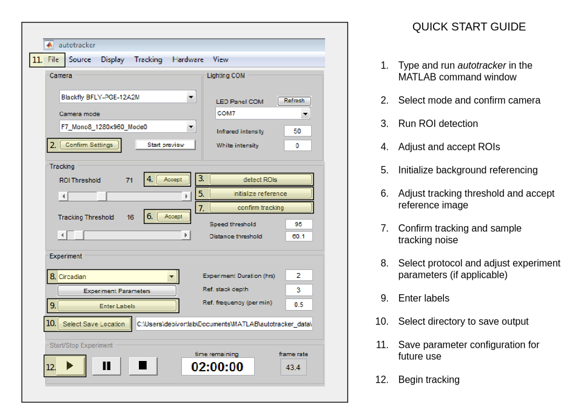

Introduction
============

Quickstart Guide
----------------

<figure style="text-align: center">
    
    <figcaption class="center_cap" style="text-align: center">
    </figcaption>
</figure>

{width="95%"}

Overview
--------

MARGO is a MATLAB-based software package for real-time, high-throughput
tracking of animals. Rapid tracking and identity sorting in real-time
means that MARGO is particularly useful for applications requiring
closed-loop control of individual stimulus delivery and massively
high-throughput behavioral screens where video storage and processing
would otherwise be rate-limiting. Margo has two fundamental modes of
tracking:

1.  **Single Tracking** - This mode is designed to track spatially
    segregated animals in parallel. Spatial segregation allows
    individuals to be tracked separately in defined regions of interest
    (ROIs). Single tracking operates on a single animal per ROI and can
    track many hundreds or thousands of individuals in parallel at high
    acquisition rates. In this mode, individual identities can be
    maintained indefinitely without supervision.

2.  **Multi Tracking** - This mode is designed to track groups of
    animals in parallel in one or more ROIs. Multi tracking can be used
    to track spatial distribution, activity level, and group dynamics
    that do not require maintenance of individual identities.

Many existing tracking platforms such as Ctrax, idTracker, and
FlyTracker are designed to track and maintain individual identities of
mixed groups individuals. Tracking identity in mixed groups requires
resolving identities through collisions where bodies are overlapping.
This approach offers the ability to study social behaviors, but because
collision resolution is computationally expensive, software packages
focused on solving this perform acquisition and tracking separately.
Assigning centroid identity by associating individual with a predefined
region of interest (ROI) allows MARGO to track individuals in real-time
and avoid recording image data altogether.

MARGO offers additional utility through extensive GUI-based
customization of hardware settings, advanced tracking parameters,
ROI-detection modes, and saved preferences. In addition to centroid
data, MARGO can output timestamps, body orientation, body size, speed,
heading direction, angular velocity, and other custom defined metrics.
Support for cameras, external displays, and serial COM devices make it
possible to integrate hardware into experimental paradigms. MARGO
facilitates experimental paradigms that require closed loop control of
individual stimuli based on individual behavior. Furthermore, a small
data footprint and robustness to tracking noise makes MARGO ideal for
recording behavior over long time scales.

Target audience
---------------

The target audience of MARGO is any user wanting to use a single,
integrated platform for recording body position and orientation based
behavioral metrics over time, particularly for applications requiring
any of the following: 1) tracking hundreds to thousands of individuals
simultaneously with little to no human intervention 2) closed-loop
feedback between real-time tracking data and control of hardware. Many
features of behavior can be calculated or inferred from these simple
pieces of information. To extract these measurements, MARGO uses
thresholded images to track binary blobs. This means that the software
is optimized for tracking many individuals at very low-resolution and
not for high-resolution tracking of postural subfeatures (eg. tracking
positions or orientations of individual body parts). Relying in ROIs to
track individual identity also means that MARGO is built for
high-throughput experiments where individuals are physically separated
into isolated arenas (eg. bottomless 96 well plates). MARGO is not
designed for collision resolution and therefore does not track the
identities of multiple individuals sharing the same arena.

Experimental workflow
---------------------

Every live experiment conducted in MARGO follows the same fundamental
workflow to ensure that the software assign regions of interest,
separates the interesting parts of the image from background, and
filters out noise in the image that would otherwise cause errors in
centroid estimation. Before recording data, the user must:

1.  Select and confirm settings for the camera

2.  Automatically or manually set ROIs

3.  Initialize a background reference image

4.  Collect a sample of clean imaging

5.  Set experiment parameters

{width="95%"}

**Select and confirm settings for the camera**

MARGO will automatically detect any available camera with an associated
MATLAB imaq adaptor installed and auto-populate the camera panel drop
down with detected cameras. If no cameras are detected, see [Camera
detection](#camdetect) for information on installing MATLAB camera
adaptors. Select the appropriate camera and the camera mode and click
\"Confirm Settings\". After initializing the camera, an initial preview
image will be visible in the display window and the downstream ROI
detection controls will be enabled. The camera preview button can be
used to start and stop a streaming preview from the camera at any time
the camera is not actively in use.

**Automatically or manually select ROIs**

Before individual identities can be tracked frame to frame, regions of
interest must be set. MARGO sets ROIs through either *automatic* or
*grid* modes. ROI detection mode is set to automatic by default.
Automatic ROI detection works on two fundamental assumptions. The first
is that your ROIs will be bright regions separated by dark boundaries.
The second is that ROIs will all generally be about the same size. To
run automatic ROI detection, select ***detect ROIs*** and adjust the ROI
threshold slider bar to find a threshold that cleanly separates ROIs
from the background. Bounding boxes and ROI numbers will be displayed
over any detected ROIs in real time. Select ***Accept*** once the ROIs
are properly detected to confirm the ROI positions. See [ROI
detection](#roidetect) for more information on automatic and grid based
ROI detection modes.

**Initialize a background reference image**

To track changes in the image from frame to frame, MARGO calculates a
difference image between each frame and a background reference image.
The background reference is generated by computing a median image from
snapshots of each ROI when the individual is in different locations.
This effectively generates an image of the ROIs without individuals. In
order for this strategy to work, MARGO must be able to track individuals
in each ROI to ensure that the individual is in distinct locations each
time a new image is taken. To collect a reference image, select
\"initialize reference\" and adjust the tracking threshold slider until
individuals are detected. Colored indicators next to each ROI will
progress from purple to green as sample images of each ROI are
collected. The \"centroid numbers\" option in the View menu bar can be
selected at any time to visualize the assignment of centroid identity.
See [Background referencing](#initializeref) for more information on how
to optimize a starting reference image.

Getting the most out of MARGO
-----------------------------

Fast, accurate tracking can be highly dependent on optimization of
parameters, camera configuration, and illumination. MARGO attempts to
make the task from setup to data collection as streamlined as possible
by making some of these decisions for you. Since every experiment and
tracking setup is a bit different, getting optimal tracking performance
out of MARGO may require adjusting both software and hardware
parameters. MARGO has many integrated features to help the user make
these decisions and then save the preferences to a user profile to
ensure that the setup process is only necessary once. Here is a helpful
but non-comprehensive list of things that will help you get the most out
of MARGO:

-   [Behavioral arenas that facilitate ROI detection](#arenasection)

-   [Bright, diffuse backlighting](#illumsection)

-   [Proper camera configuration](#camconfig)

-   [Tracking parameters customized to your ROIs and tracked
    objects](#trackingparam)

-   [Adjust acquisition rate to avoid \"over-tracking\"](#targetrate)

-   [Save your settings to a profile](#saveprofile)

<!-- -->

-   [Camera calibration to reduce lens fisheye](#camcalibrate)

-   [Use display options to visualize and validate tracking features in
    real time](#viewoptions)

-   [Calibrate MARGO to measure distances in mm](#distscale)

<!-- -->

-   [Display visual stimuli with PsychToolbox](#projsection)

-   [Use COM objects to control peripheral hardware](#comsection)