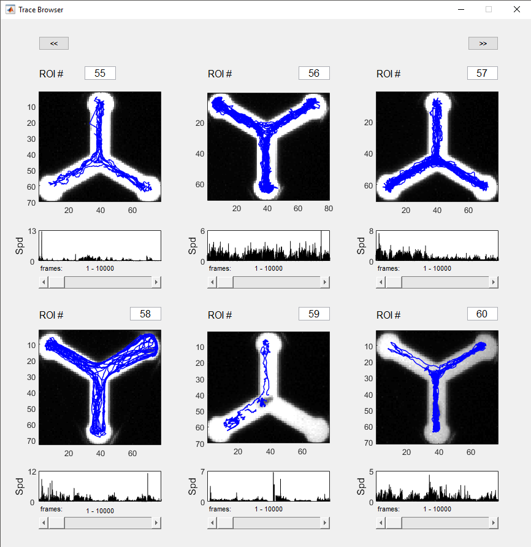

Running Analysis
================

MARGO will execute an analyze file for the accompanying run file upon
finishing tracking. Processing times can vary greatly depending on your
computer and the size of the raw data files. Once analysis is complete,
the user will be given the option to view raw centroid data. At this
point, the ExperimentData master can be loaded into the MATLAB
workspace by copying and executing the command printed to the command
window or by browsing to the save directory and manually loading the
file.

Users may wish to try processing the data multiple different ways or set
optional processing flags or parameters. For this reason, MARGO has
functions for re-processing data files, repairing broken references to
raw data files, and setting optional processing flags.

The simplest way to get started is the `analyze_multiFile`
function. This function allows the user to browse and select a parent
directory containing all files to be reprocessed. Once a parent
directory is selected, the function will search recursively through all
directories underneath for any .mat files. An optional keyword can be
provided to restrict the query to file names containing the keyword
argument. The name proptery of ExperimentData is used to query and
execute to the accompanying analyze file for each file sequentially.
This means that ExperimentData files of many different types can be
processed together in batches. The following name-value pairs can be set
to customize the analysis:

<p style="text-align: center;">
    Name-Value pairs for analuze_multiFile
</p>

| Name | Description | Values | Default | Data Types|
|------|-------------|--------|---------|-----------|
| Keyword| Restricts file search to .mat files containing keyword| *any string* |none | string |
| Save | Toggles figure and file saving | true, false | true | binary
| Raw | Sets raw data files to be generated from centroid trace features |'Speed',  'Direction', 'Theta', 'Radius'| none | string, cell array of strings
| Bootstrap|Toggles parsing speed data into discreet bouts for bootstrap resampling|true, false | false | binary |
| Regress | Toggles correction of speed data by regressing out lens distortion | true, false | false | binary |
| Handedness | Toggles extrapolation of handedness metrics from centroid traces | true, false | false | binary |
| Slide | Toggles calculating sliding average speed of speed over time | true, false | false | binary
| AreaThresh | Toggles calculating individual area thresh for parsing floor/ceiling bouts | true, false | false | binary


Data Output
===========

Data is output from MARGO in three phases. Once the play button is
pushed, MARGO generates and saves a .mat file with all meta data during
initialization of the experiment. During tracking, MARGO writes raw data
fields to the hard drive. Once tracking is finished, a round of
protocol-specific, automatic data processing is performed to calculate
metrics for higher level features of the raw data.

Raw data
--------

Raw data is saved frame by frame to binary data files located in the
subdirectory under the user-defined save path. Each tracked field is
saved independently to its own file. The data can be read directly into
MATLAB or accessed indirectly through memmaps in the ExperimentData
object. The simplest way to access the data quickly is through the
automatically generated memory maps. However, the binary data files can
be accessed via MATLAB's *fread* function. If attempting to access the
raw data directly, keep in mind that the data must be read in the
correct precision and dimensions. In addition to the ability to record
user-defined raw data, MARGO can record the following pre-defined raw
data fields: *centroid*, *inter-frame interval (ifi)*, *area*,
*orientation*, and *speed*.

The ExperimentData object (expmt)
--------------------------------------

A single object, ExperimentData, allows the user to access all raw and
processed data output. The master data container is saved to a .mat file
in an auto-generated, time-stamped directory under the save directory.
The ExperimentData master data container can be easily loaded into
MATLAB and is a convenient way to browse and manipulate all the data.
ExperimentData contains four core properties:

1.  Data - Contains custom *RawDataField* objects which contain meta
    data about the raw data files and allow the user to dynamically
    access raw data from the files.
2.  Meta - Contains experiment meta data (e.g. ROIs, background
    references, labels, file path information).
3.  Parameters - Contains all experimental parameters and their values.
4.  Hardware - Contains hardware objects (e.g. cameras, displays) and
    associated meta data.

See [table 5.2](#expmttable) for a complete details of the contents of
the ExperimentData object.

### Experiment meta data

All meta data from the experiment is saved to the master data container
during initialization of tracking. By default, MARGO records the
following meta data:

-   time, date, and duration
-   ROI position and dimensions
-   label meta data
-   camera and other hardware settings
-   referencing and tracking parameters
-   imaging noise statistics
-   raw data file paths, format, and dimensions
-   protocol specific parameters

### Memory mapped raw data

Raw data files can be accessed and de-accessed through the
ExperimentData master data container through the use of a custom
*RawDataMap* object. These objects are built on top of MATLAB's [memory
maps](https://www.mathworks.com/help/matlab/ref/memmapfile.html), for
efficient access of large binary data files. Although MARGO has a much
lighter data footprint than raw video data, raw data files can still be
cumbersome, or impossible to hold in memory. Because MARGO can
efficiently track and record activity from thousands of individuals over
very long timescales, raw data files can easily exceed several gigabytes
in size. For this reason, raw data is dynamically read from the hard
drive to avoid *out of memory* errors. Mapped raw data can be
dynamically accessed under *expmt.data.(raw field name).raw* like a
normal MATLAB array. For example, centroid data can be accessed under
**expmt.data.centroid.raw** and is formated as $M x N x P$ matrix where
M = number of frames, N = 2 (x,y), and P = number of ROIs. If we wanted
to assign the centroid coordinates for ROI \#10 for the entire length of
the experiment to temporary variables, we could call:

```matlab
x = expmt.data.centroid.raw(:, 1, 10);
y = expmt.data.centroid.raw(:, 2, 10);
```

### ExperimentData subfield details

#### Raw Data (expmt.data)

RawDataFields and RawDataMaps used to access data from binary raw data files such as frame to frame centroid data and timestamps. The fields listed below are the default, minimum raw data outputs.

|Field|Description|Subfields|
|---|---|---|
|centroid|RawDataMap object for tracking centroid data (num frames x 2 x num ROIs) |map, path, precision, fID, dimension|
|time|RawDataMap object for inter-frame interval (sec) data (num frames x 1)|map, path, precision, fID, dimension|
|dropped_frames|RawDataMap object for which objects were tracked in each frame (num frames x num ROIs)|map, path, precision, fID, dimension|
||||

#### Meta Data (expmt.meta)

Struct of meta data for the experiment such as ROI data, label info, background reference, and noise correction.

|Field|Description|Subfields|
|---|---|---|
|date|string: timestamp for start of the experiment in MM-DD-YY-hh-mm-ss format |none|
|fields| cell array: names of raw data fields | none |
|finish| boolean: post-process data | none |
|labels_table| table: label data for each ROI | box, comments, day, ID, sex, strain, treatment|
|name|string: name of the experimental protocol|none|
|noise|struct: pixel noise distributions and other noise correction meta data| dist, mean, std, roi_dist, roi_mean, roi_std|
|num_dropped|int: number of frames dropped (i.e. not tracked) for each trace|none|
|num_frames|int: number of frames recorded | none|
|num_traces|int: number of individual traces tracked| none|
|options| struct: post-processing options | areathresh, bouts, bootstrap, disable, handedness, raw, regress, save, slide|
|path|struct: file path information for the parent ExperimentData object|dir, name, full, fig|
|ref|struct: background reference image and parameters | cen, ct, im, last_update, stack, t, thresh, update|
|roi|struct: ROI positions and other meta data|bounds, centers, corners, im, mask, mode, n, orientation, pixIdx, (optional: cam_dist, col, grid, row, shape, tform, vec)|
|sex| string: sex of the first labeled group|
|strain|sting: strain name of the first labeled group|none|
|source|string: video data input source (camera or video)|none|
|track_mode| string: tracking mode (single or multitrack) | none |
|treatment|string: experimental condition or treatment of the first labeled group|none|
|video|struct: video reader object for video file input and associated meta data||
|vignette|struct: vignette subtraction image and other vignette correction meta data| im, mode|
||||

#### Hardware (expmt.hardware)

Struct of hardware devices detected by MARGO and available configurations.

|Field|Description|Subfields|
|---|---|---|
|cam|stuct: video input objects and associated parameters | activeID, AdaptorName,  bitDepth, DeviceInfo, calibrate, calibration, DeviceIDs, frame_rate, settings, src, vid|
|COM|struct: serial COM objects, COM ports, and associated parameters | aux, light, ports||light| struct: illumination panel light levels| infrared, white|
|projector|struct: displays detected through psychtoolbox and associated parameters|reg_params, Fx, Fy|
|screen| struct: psychtoolbox parameters for the active display| ifi, screenNumber, vbl, waitframes, window, windowRect, xCenter, yCenter|
||||

#### Parameters (expmt.parameters)

|Field|Description|Values|
|---|---|---|
|area_min| maximum blob size for extraction| numeric constant|
|bg_adjust| adjust difference image to enhance contrast | false, true|
|bg_mode| expected color of background| auto, dark, light|
|dilate_el| structuring element for blob dilation| structuring element|
|dilate_sz| pixel radius of blob dilation element| numeric constant|
|dist_thresh| minimum distance to ROI center for distance ROI sorting |numeric constant|
|duration| experiment duration in hours |numeric constant|
|erode_el|structuring element for blob erosion| structuring element|
|erode_sz|pixel radius of blob erosion element| numeric constant|
|estimate_trace_num| flags automatic estimation of number of active traces in each ROI| false, true|
|initialized| initialization status of tracking| false, true|
|max_trace_duration| required number of consecutive frames for traces to die or revive| numeric constant|
|mm_per_pix| millimeter to pixel unit conversion factor | numeric constant|
|noise_estimate_missing| status of pixel noise distribution | false, true|
|noise_ref_thresh| standard deviations above noise sample required to force background reset| numeric constant|
|noise_sample| noise sampling required prior to tracking | false, true|
|noise_skip_thresh| standard deviations above noise sample required to skip frames| numeric constant|
|ref_depth| number of background reference images in rolling stack| numeric constant|
|ref_freq| frequency to add background reference image to rolling stack (per min)|numeric constant|
|ref_fun| function use to compute background reference from stack | mean, median |
|ref_mode| set single static reference and rolling reference | live, static |
|roi_mode| ROI definition mode| auto, grid|
|roi_thresh| automatic ROI segmentation threshold | numeric constant|
|roi_tol| number of standard deviations from cluster mean to group ROIs | numeric constant|
|sort_mode| ROI sorting criteria | bounds, distance, grid|
|speed_thresh| maximum allowed speed of tracked objects (distance/sec) | numeric constant|
|track_thresh|stuct: video input objects and associated parameters |none|
|target_rate| upper limit for acquisition rate (frames/sec) | numeric constant|
|num_traces| number of traces per ROI |numeric vector|
|units| distance unit of measurement | millimeters, pixels|
|vignette_sigma| standard deviation of vignette correction gaussian | numeric constant|
|vignette_weight| vignette correction gaussian weight | numeric constant (0-1)|
|||

### Auto-processed centroid features

When tracking is finished, MARGO can be configured to run a
protocol-specific, data-processing script to perform data pre-processing
or analysis. All tracking protocols in MARGO minimally record centroid
position and inter-frame interval. As examples of higher level features,
MARGO uses post-processing to generate measures of: *individual
activity*, *locomotor handedness*, and *stimulus evoked behaviors*.

Figures
-------

Depending on the selected tracking protocol, MARGO may output figures
during post-processing. All figures are saved to an auto-generated
*figures* directory under the user specified save location. The figure
directory is saved to *expmt.meta.path.fig* in the master data
container.

### Raw Trace Browser

Users will be prompted to browse raw trace data upon tracking
completion. Select ***browse traces*** to open a simple GUI for plotting
centroid data. Traces from any ExperimentData master data container
can be browsed at anytime by loading the .mat file and running
***plotTraces(ExperimentData)*** from the MATLAB command line.

{width="20%"}